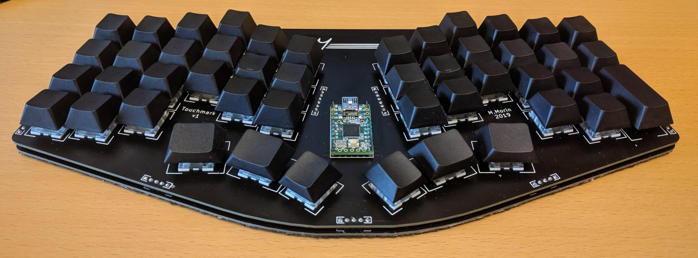

# Touchmark
One-piece split, staggered column 40% keyboard. First prototyped on, and inspired by, the [Signum 3.0](http://troyfletcher.net/keyboard_sales.html#signum_30). Low profile and case-less yet still robust enough for travel. Designed in KiCad with symbols and footprints from [keyboard-parts](https://github.com/mvmorin/keyboard-parts) library.

# Features
* Low profile and case-less.
* Standard 4x12 layout.
* Teensy 2.0 and Pro-Micro compatible.
* Full PCB design, including backplate.
* Dedicated MX and Alps plates.
* Flat bottom makes it possible to use it directly on top of a laptop keyboard.

# Construction
The PCB and plate are connected via the switches and standard 2.54 mm pin headers. The Teensy/ProMicro is mounted on the plate itself (or on the base PCB if no plate is used). Only through-hole soldering is necessary and all components are placed on the top of the PCB, leaving the bottom of the keyboard flat. It is recommended to cover the bottom with some soft rubber-like material, I glued on some black shelf liner. It is of course possible to use small rubber feet instead, but this will leave the PCB exposed. It also makes it harder to use on top of a laptop keyboard since the bottom then isn't completely flat.

# PCB Files
The gerber-files for the latest version of the base PCB and the plates are found in the *gerber* directory. For instructions on how to order, see the following [40percent.club post](http://www.40percent.club/2017/03/ordering-pcb.html). However, please read the **Known Issues** section below and be aware that the tolerances of PCB milling can be large.

# Known Issues
* Alps cutouts are a little tight. About 60% of the cutouts in the test print needed filing.
* Cherry stabilizer cutout too small. All cutouts in the test print needed filing to fit at all.

# Future Updates
Things I'm currently thinking about changing, but who knows when...
* Change from row-high to row-low matrix for easier matrix scan in [tmk](https://github.com/tmk/tmk_keyboard) and to avoid turning on the LED when pressing column 12 keys.
* Increased stagger for pinky keys.
* Change split angle, currently slightly uncomfortable for me. The change of pinky-stagger will probably require a change to the split.
* Remove unused keys on bottom row (2,3,10,11).
* Move thumb clusters up.

# Licenses

This project is released under the [Creative Commons CC-BY-SA 4.0](https://creativecommons.org/licenses/by-sa/4.0/legalcode) license, Copyright (c) Martin Morin 2020.
Some footprints and symbols are based on parts from the [KiCad libraries](https://kicad-pcb.org/libraries/), released under the same [CC-BY-SA 4.0](https://creativecommons.org/licenses/by-sa/4.0/legalcode) license.
